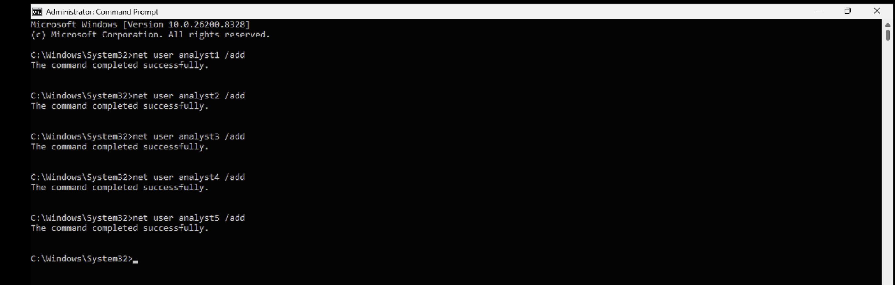
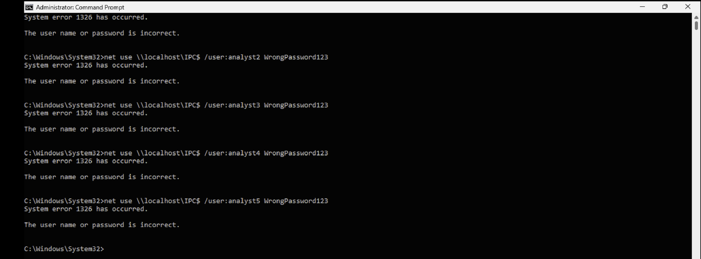
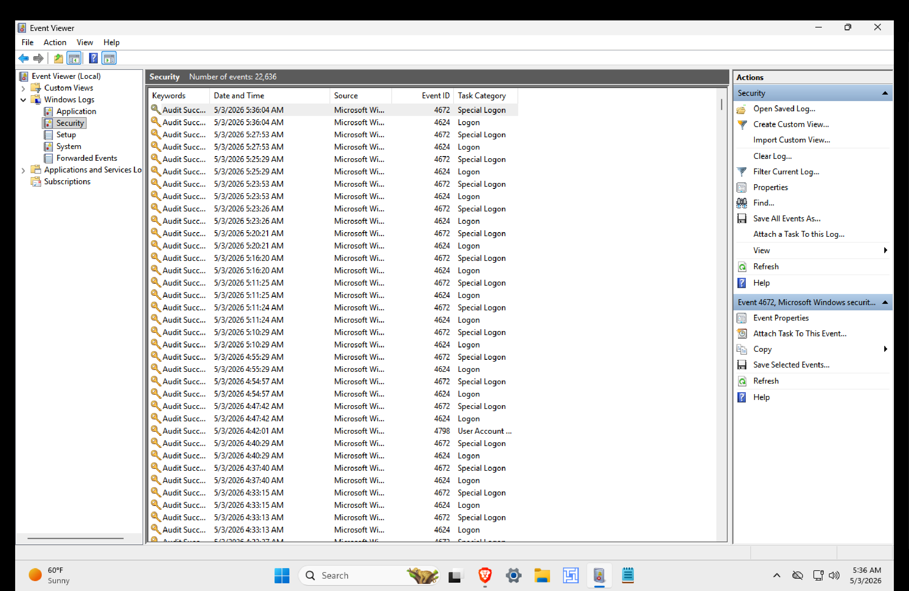
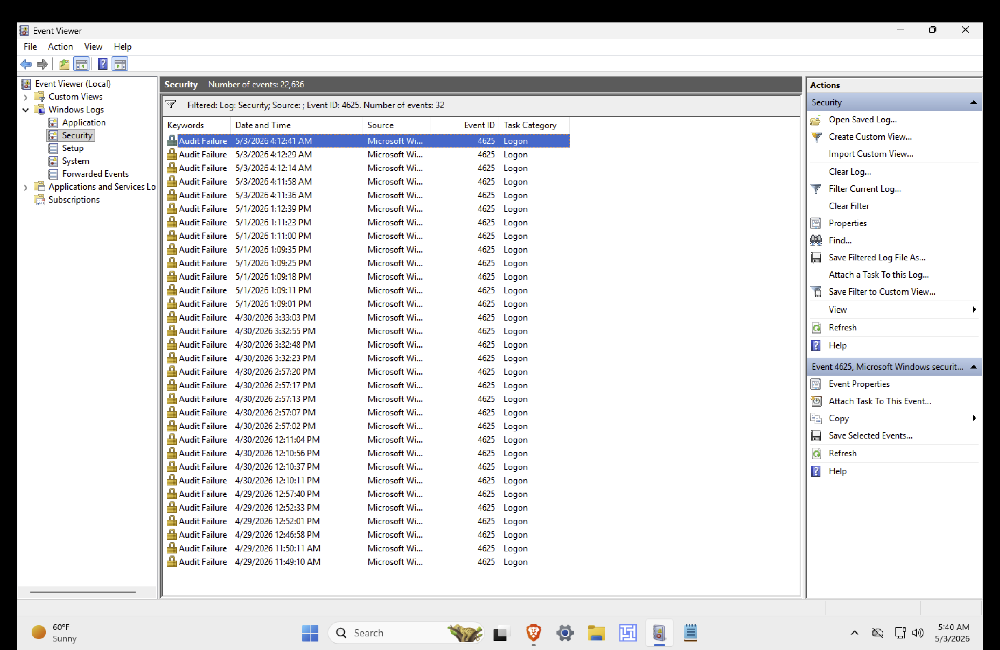
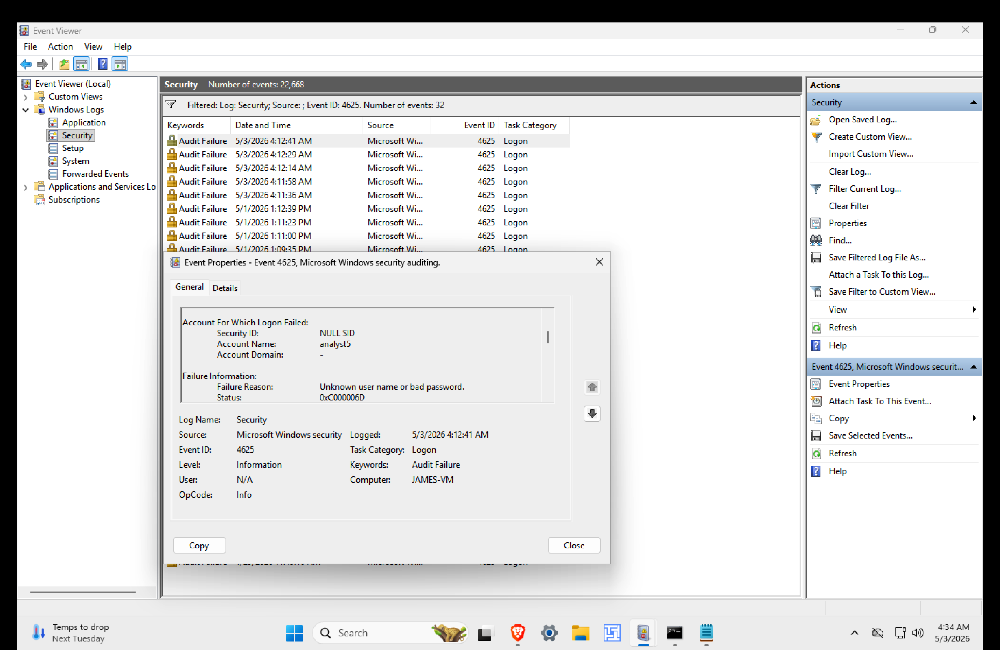
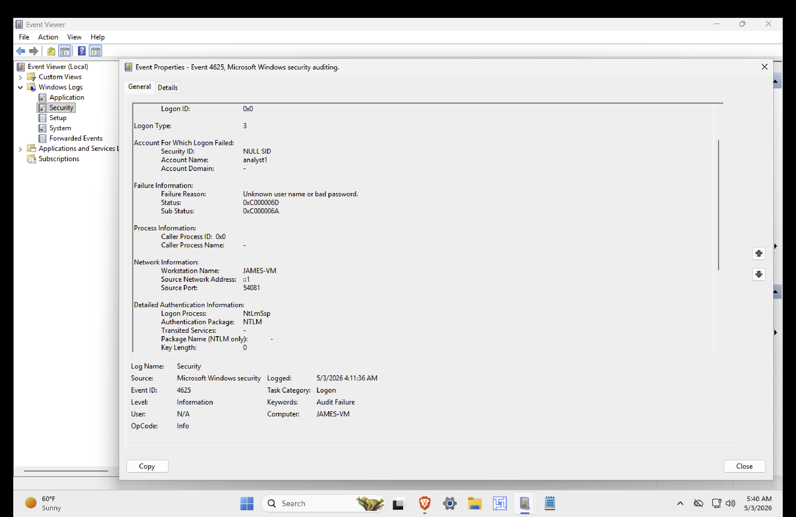
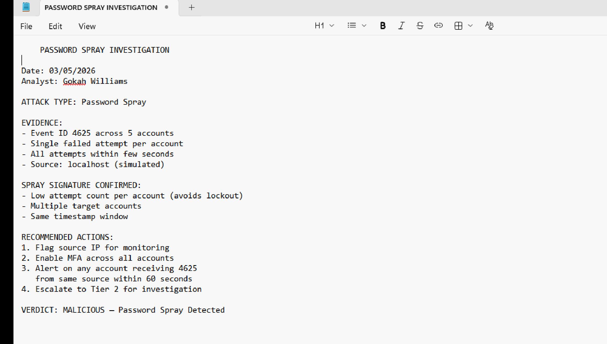

# Day 06 – SOC Tier 1 Incident Report: Password Spray Attack Detection on Active Directory

---

## Incident Summary

- **Incident Type:** Password Spray Attack (Credential Access)
- **Severity:** High
- **Detection Method:** Windows Security Event Log Analysis (Event ID 4625)
- **Tools Used:** Command Prompt, Event Viewer, `net user`, `net use`, Notepad
- **Status:** Investigated (Simulated SOC Environment)

---

## Executive Summary

This investigation focuses on the simulation and detection of a password spray attack targeting multiple user accounts on a Windows host. Unlike traditional brute-force attempts, password spraying uses a single common password against many accounts to evade account lockout policies.

The analysis correlates failed authentication events across multiple accounts within a short timeframe to identify the spray signature, distinguish it from brute-force activity, and document SOC-level detection methodology.

---

## Affected System

- **Operating System:** Windows 10/11 (Victim Machine)
- **Service Under Investigation:** Local Authentication / SMB (IPC$)
- **Log Sources:**
  - Windows Security Event Log
  - Event ID 4625 (Failed Logon)
  - Event Viewer → Windows Logs → Security
  - Authentication subsystem (LSASS)

---

## Investigation Methodology

---

### 1. Attack Pattern Recognition

- Reviewed differences between brute-force and password spray techniques
- Identified spray as a low-and-slow credential access method
- Confirmed spray evades lockout thresholds by limiting attempts per account

### SOC Observations:

- Brute force: many passwords → one account (high lockout risk)
- Password spray: one password → many accounts (low lockout risk)
- Spray attacks are deliberately slow and stealthy to avoid detection

---

## Account Enumeration & Setup

---

### 2. Target Account Creation (Simulation)



- Created five local user accounts (`analyst1` – `analyst5`) for controlled simulation
- Verified accounts using `net user`
- Confirmed accounts visible to authentication subsystem

### SOC Observations:

- Account discovery (T1087) typically precedes a spray attack
- In real environments, attackers enumerate users via LDAP, OSINT, or breach data
- Visibility into account creation events is critical for early detection

---

## Attack Simulation

---

### 3. Password Spray Execution



- Executed `net use` against `\\localhost\IPC$` using one password across all five accounts
- Each attempt produced a failed authentication event
- All attempts completed within a short time window

### SOC Observations:

- Single password reused across multiple accounts is the spray signature
- Rapid succession from a single source increases detection confidence
- IPC$ access attempts are common attacker targets for SMB-based authentication

---

## Detection & Log Analysis

---

### 4. Event Viewer – Security Log Review



- Opened Event Viewer → Windows Logs → Security
- Verified Security log was actively recording authentication events
- Confirmed forensic data availability for analysis

### SOC Observations:

- Windows Security Event Log is the primary source for authentication forensics
- Event ID 4625 indicates a failed logon attempt
- Real-time log monitoring is essential for spray detection

---

### 5. Event ID 4625 Filtering



- Applied filter for Event ID 4625 to isolate failed logon events
- Identified five failed authentication events matching the simulation window
- Validated time correlation across all events

### SOC Observations:

- Filtering by 4625 is the standard first step for credential access investigations
- Multiple 4625 events across different accounts within seconds is a strong indicator
- Time-based correlation is critical for pattern recognition

---

### 6. Failed Logon Pattern Analysis



- Reviewed all 4625 events in chronological order
- Identified five distinct usernames targeted from the same source
- Confirmed each account received only one failed attempt

### SOC Observations:

- Different usernames + same source + short timeframe = password spray signature
- Single failed attempt per account confirms lockout evasion technique
- This pattern differs sharply from brute-force (same username, many failures)

---

### 7. Event Detail Inspection



- Examined individual 4625 event metadata
- Captured Account Name, Source Workstation, Logon Type, and Failure Reason
- Documented timestamps for correlation

### SOC Observations:

- Logon Type 3 indicates network logon (SMB/IPC$ access)
- Failure Reason "Unknown user name or bad password" confirms credential mismatch
- Source Workstation field critical for identifying attacker origin

---

## Pattern Comparison

---

### 8. Brute Force vs. Password Spray Signature

- Documented log-level differences between attack types
- Brute force: repeated 4625s on the same account
- Password spray: single 4625s spread across multiple accounts

### SOC Observations:

- Recognizing the difference is a core Tier 1 analyst skill
- Detection rules must account for both attack patterns separately
- Spray detection requires correlation across accounts, not within one

---

## Analyst Verdict Documentation

---

### 9. Investigation Verdict



- Documented attack type, evidence, signature confirmation, and recommendations
- Verdict logged for Tier 2 escalation reference
- Standardized SOC reporting format applied

### SOC Observations:

- Structured verdicts ensure consistent escalation and handoff
- Documentation must include evidence, timeline, and recommended actions
- Verdict serves as the primary artifact for incident review

---

## Indicators of Compromise (IOCs)

- Multiple Event ID 4625 entries within a short time window
- Single password attempted across multiple distinct usernames
- Same source workstation across all failed logon events
- Logon Type 3 (network) failures targeting IPC$
- Sequential authentication attempts under lockout threshold
- Absence of corresponding Event ID 4624 (successful logon) per account

---

## MITRE ATT&CK Mapping

| Behavior              | Technique ID | Description                  |
|-----------------------|--------------|------------------------------|
| Password Spraying     | T1110.003    | Credential Access            |
| Brute Force (Parent)  | T1110        | Credential Access            |
| Account Discovery     | T1087        | Reconnaissance               |
| Valid Accounts        | T1078        | Initial Access / Persistence |
| Network Logon Abuse   | T1021        | Lateral Movement             |

---

## SOC Analyst Findings

- Password spray attack pattern confirmed in Security Event Log
- Five distinct accounts targeted with a single shared password
- All failed attempts originated from the same source within seconds
- No account lockouts triggered, consistent with spray evasion technique
- No successful authentications observed during the attack window

---

## SOC Analyst Response

- Flag source workstation/IP for continuous monitoring
- Enforce Multi-Factor Authentication (MFA) across all user accounts
- Configure alert on multiple Event ID 4625 events from a single source within 60 seconds
- Reduce account lockout threshold and review lockout policy
- Implement smart lockout / risk-based authentication
- Deploy SIEM correlation rule for cross-account failed logon patterns
- Escalate to Tier 2 for source attribution and threat hunting

---

## Analyst Insight

Password spray attacks succeed by exploiting weak detection logic that focuses on per-account thresholds rather than cross-account patterns. SOC analysts must build detection around behavioral correlation — recognizing that a single failed logon across many accounts is a stronger indicator of compromise than repeated failures against one.

---

## Learning Outcome

This investigation demonstrates the ability to:

- Distinguish password spray attacks from brute-force attempts
- Simulate credential access attacks in a controlled environment
- Analyze Windows Security Event Logs for authentication anomalies
- Filter and correlate Event ID 4625 events across multiple accounts
- Identify spray signatures through time-based pattern recognition
- Document structured analyst verdicts for SOC escalation
- Apply MITRE ATT&CK framework to credential access techniques
- Recommend defensive controls aligned with detection findings

---

## Repository Structure

```
.
├── README.md
├── screenshots/
│   ├── attack_pattern.png
│   ├── user_creation.png
│   ├── spray_attempt.png
│   ├── event_viewer.png
│   ├── event_4625_filter.png
│   ├── failed_logon_events.png
│   ├── event_details.png
│   ├── pattern_comparison.png
│   └── analyst_verdict.png
```

---

## Conclusion

This investigation demonstrates how password spray attacks can be detected through structured Windows Event Log analysis and behavioral pattern recognition. By correlating failed authentication events across multiple accounts and distinguishing spray signatures from brute-force patterns, SOC analysts can identify stealthy credential access attempts before they escalate into account compromise.
